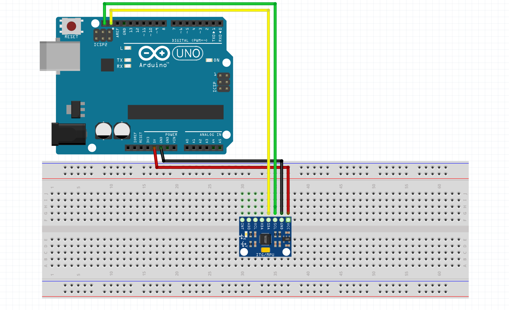

<h1>Design Team 3: Circuits</h1>

About
---
This repository contains the circuit designs & board layouts for the SHAD online Blue Origin design challenge.

Project Pinout (KiCad/Eeschema)
---

Accelerometer Pinout (On Breadboard)
---

