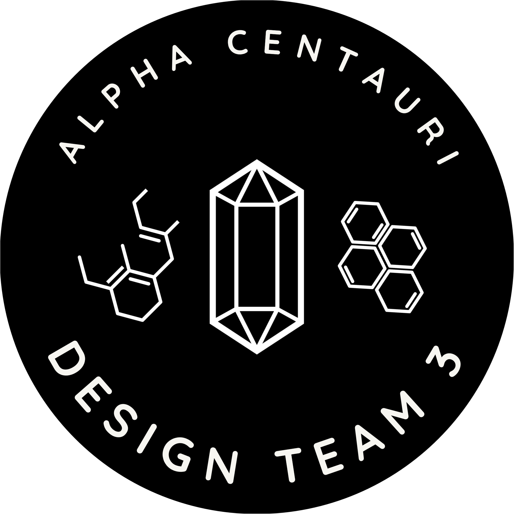
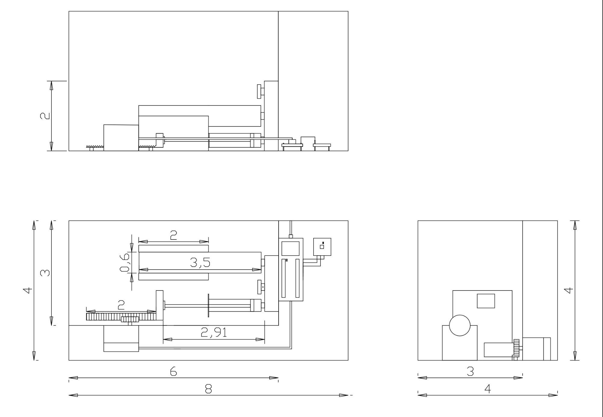
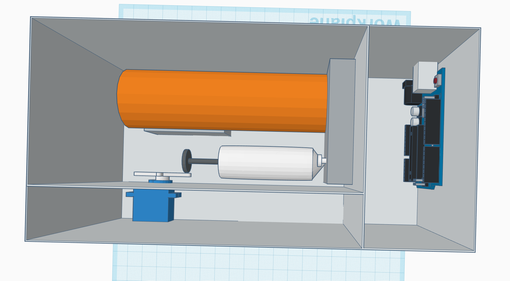
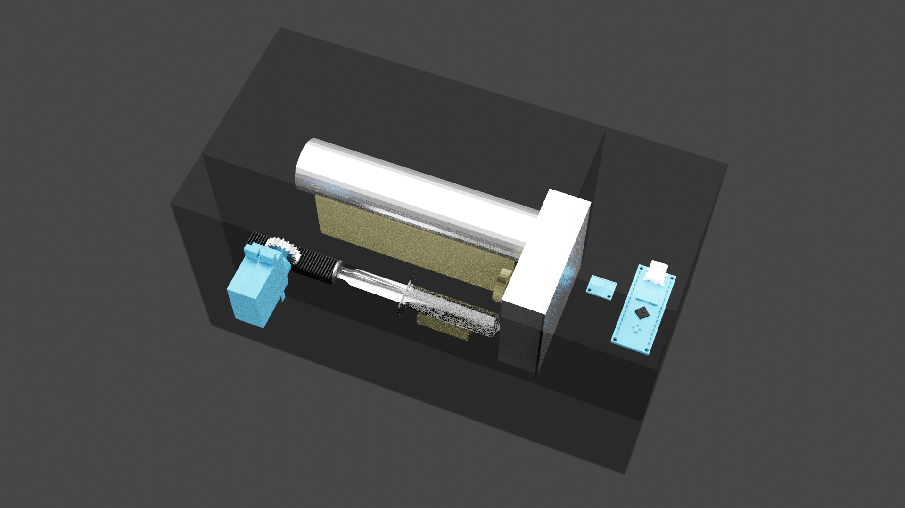
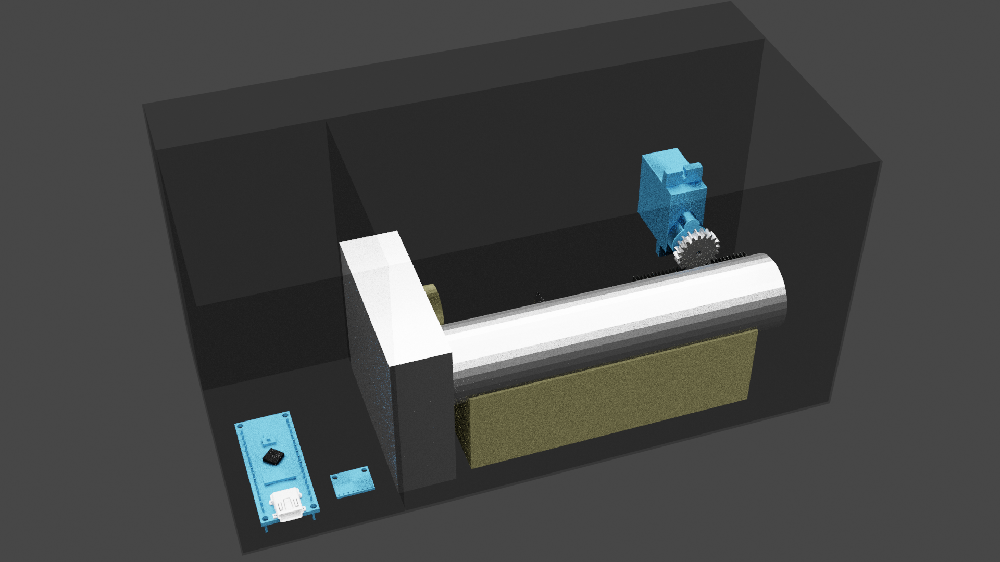
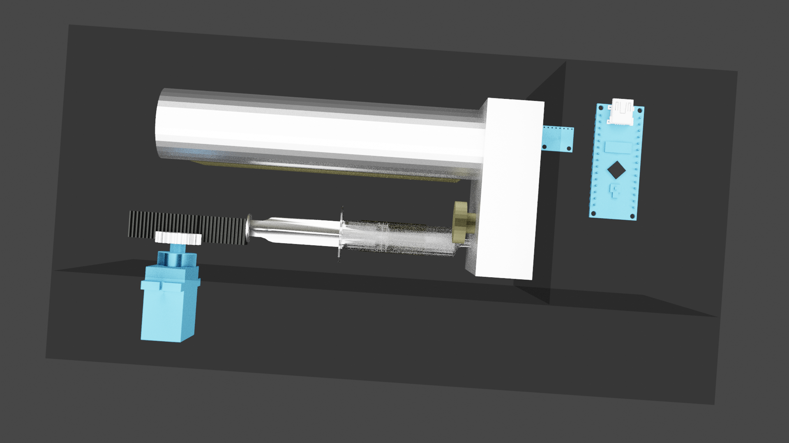
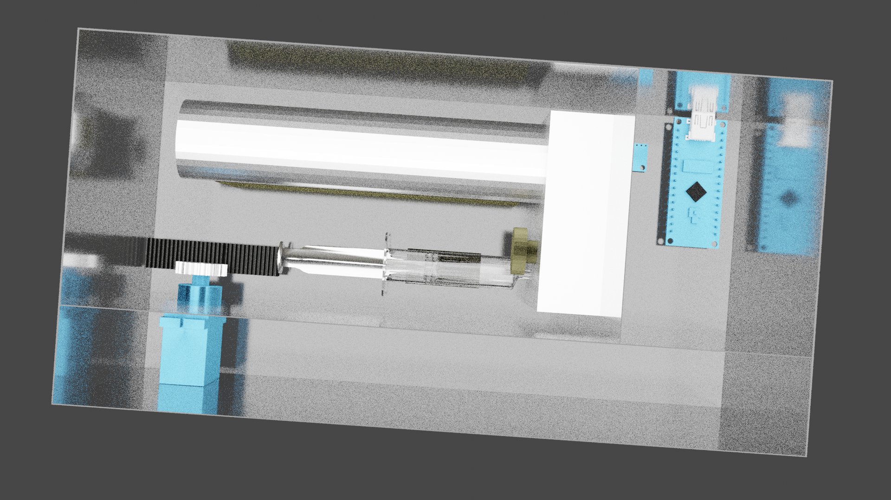
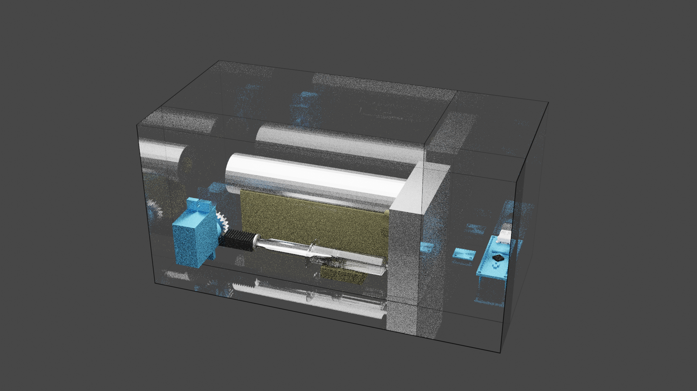
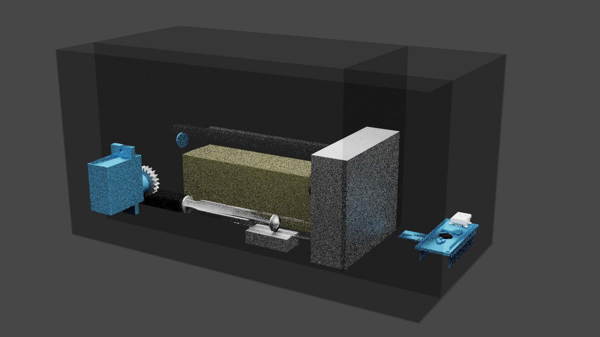

 
 
<h1>Design Team 3: Circuits & Designs</h1>

About
---
This repository contains the circuit layouts and 3D designs for the SHAD online Blue Origin design challenge.

Project Pinout (KiCad/Eeschema)
---

Accelerometer Pinout (On Breadboard)
---

Box Layout (top down, side(back), side(right))
---

3D project design
---

Blender design image renders
---

